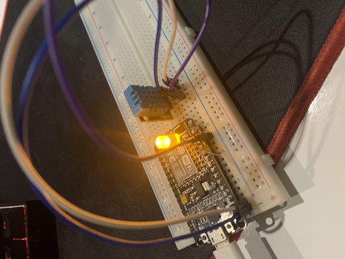

<a name="readme-top"></a>

<!-- PROJECT LOGO -->
<br />
<div align="center">
  <a href="https://github.com/charafmrah/home-health-monitor">
    
  </a>

 <h3 align="center">Home Health Monitor IoT Device & Website</h3>

  <p align="center">
    A Next Js website to control & visualize data from an IoT device.
    <br />
    <a href="https://github.com/charafmrah/home-health-monitor"><strong>Explore the docs »</strong></a>
    <br />
    <br />
    <a href="https://github.com/charafmrah/home-health-monitor-device">Device Code</a>
    ·
    <a href="https://github.com/charafmrah/home-health-monitor/issues">Report Bug</a>
    ·
    <a href="https://github.com/charafmrah/home-health-monitor/issues">Request Feature</a>
  </p>
</div>

<!-- ABOUT THE PROJECT -->

## About The Project

![Home Health Monitor Screen Shot][product-screenshot-1]

An IoT device that publishes sensory data to AWS IoT core over WiFi. The data is then routed using the   Rules Engine to a DynamoDB database. A Next.Js website acts as an MQTT client to subscribe to the events sent by the device to visualize it & control the device.




### Built With

- [![Next][next.js]][next-url]
- [![React][react.js]][react-url]
- [![TypeScript][typescript]][typescript-url]
- [![JavaScript][javascript]][javascript-url]
- [![Tailwind][tailwindcss.com]][tailwind-url]
- [![AWS][aws]][aws-url] 

<p align="right">(<a href="#readme-top">back to top</a>)</p>

<!-- GETTING STARTED -->

## Getting Started

First, run the development server:

```bash
npm run dev
# or
yarn dev
```

Open [http://localhost:3000](http://localhost:3000) with your browser to see the result.

You can start editing the page by modifying `app/index.tsx`. The page auto-updates as you edit the file.

[API routes](https://nextjs.org/docs/api-routes/introduction) can be accessed on [http://localhost:3000/api/hello](http://localhost:3000/api/hello). This endpoint can be edited in `pages/api/hello.ts`.

The `pages/api` directory is mapped to `/api/*`. Files in this directory are treated as [API routes](https://nextjs.org/docs/api-routes/introduction) instead of React pages.

<p align="right">(<a href="#readme-top">back to top</a>)</p>

<!-- CONTRIBUTING -->

## Contributing

Contributions are what make the open source community such an amazing place to learn, inspire, and create. Any contributions you make are **greatly appreciated**.

If you have a suggestion that would make this better, please fork the repo and create a pull request. You can also simply open an issue with the tag "enhancement".
Don't forget to give the project a star! Thanks again!

1. Fork the Project
2. Create your Feature Branch (`git checkout -b feature/AmazingFeature`)
3. Commit your Changes (`git commit -m 'Add some AmazingFeature'`)
4. Push to the Branch (`git push origin feature/AmazingFeature`)
5. Open a Pull Request

<p align="right">(<a href="#readme-top">back to top</a>)</p>

<!-- CONTACT -->

## Contact

Charaf Mrah - [LinkedIn](https://linkedin.com/in/charafmrah) - [@charafmrah](https://twitter.com/charafmrah) - charaf4charaf@gmail.com

<p align="right">(<a href="#readme-top">back to top</a>)</p>

<!-- ACKNOWLEDGMENTS -->

## Acknowledgments

- [Google Charts](https://developers.google.com/chart/interactive/docs)
- [ReadME template](https://github.com/othneildrew/Best-README-Template)

<p align="right">(<a href="#readme-top">back to top</a>)</p>

<!-- MARKDOWN LINKS & IMAGES -->
<!-- https://www.markdownguide.org/basic-syntax/#reference-style-links -->

[linkedin-url]: https://linkedin.com/in/charafmrah
[product-screenshot-1]: screenshot1.png
[product-screenshot-2]: screenshot2.png
[next.js]: https://img.shields.io/badge/next.js-000000?style=for-the-badge&logo=nextdotjs&logoColor=white
[next-url]: https://nextjs.org/
[react.js]: https://img.shields.io/badge/React-20232A?style=for-the-badge&logo=react&logoColor=61DAFB
[react-url]: https://reactjs.org/
[tailwindcss.com]: https://img.shields.io/badge/Tailwind-563D7C?style=for-the-badge&logo=tailwindcss&logoColor=white
[tailwind-url]: https://tailwindcss.com
[javascript]: https://img.shields.io/badge/JavaScript-f7df1e?style=for-the-badge&logo=javascript&logoColor=black
[javascript-url]: https://javascript.com
[typescript]: https://img.shields.io/badge/TypeScript-007ACC?style=for-the-badge&logo=typescript&logoColor=white
[typescript-url]: https://www.typescriptlang.org/
[aws]: https://img.shields.io/badge/Amazon%20AWS-232F3E?style=for-the-badge&logo=amazonaws&logoColor=white
[aws-url]: https://aws.amazon.com/
